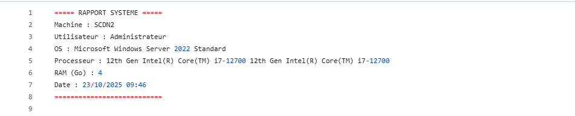
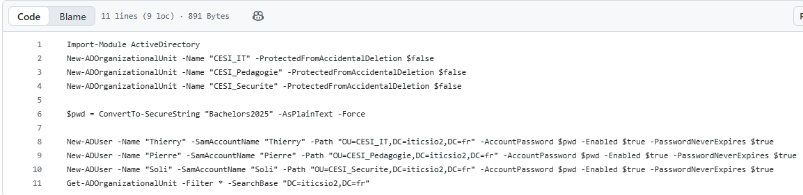
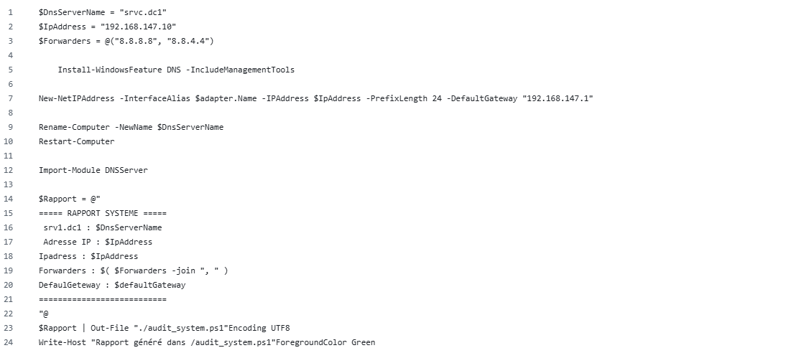
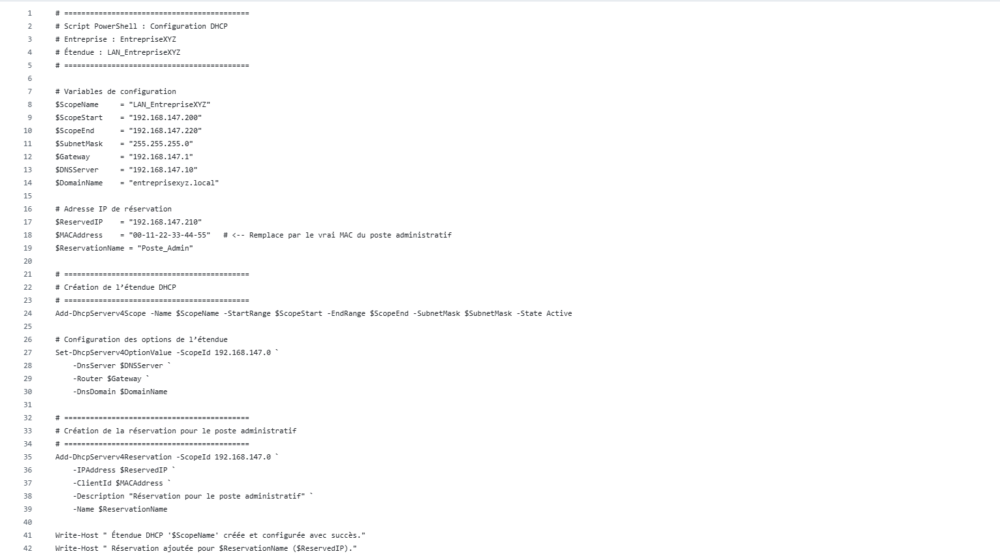
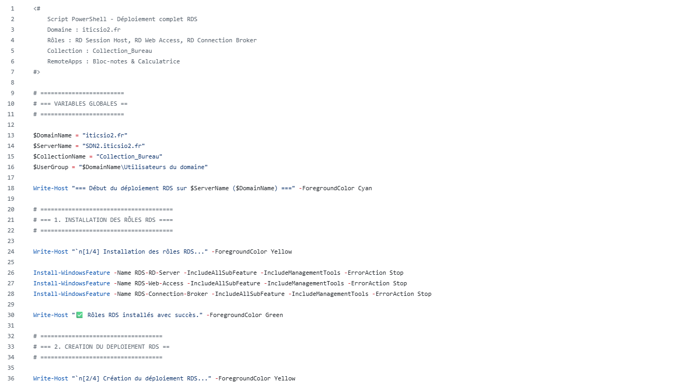
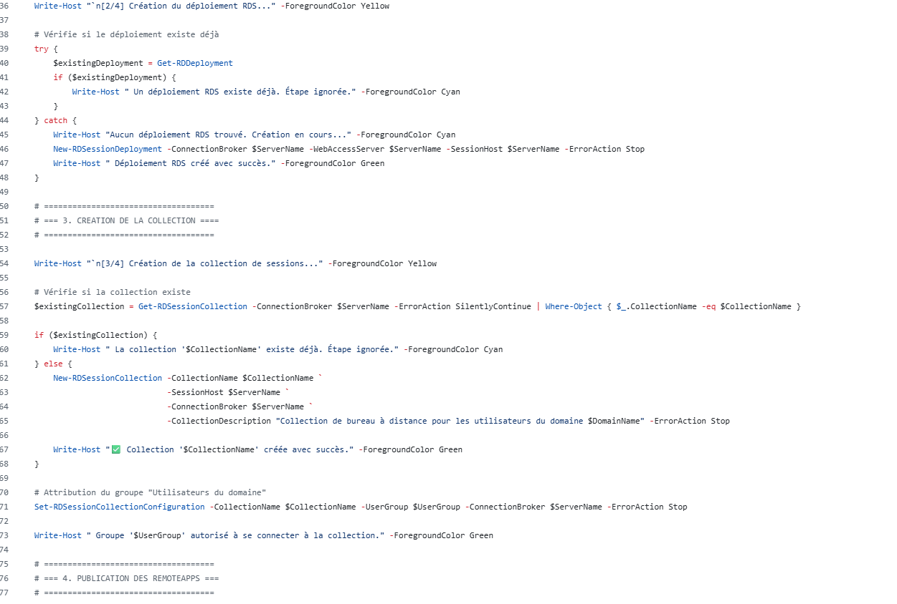
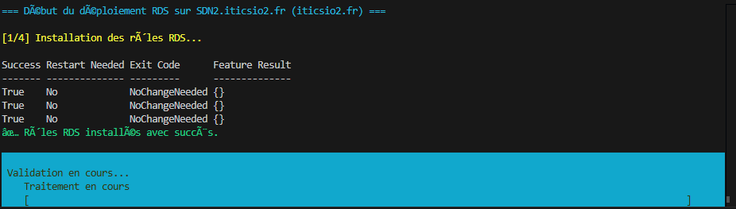

# Tp-powershell

## 1. Exercice 1 – Audit système

évaluer l’état et la configuration d’une machine pour assurer son bon fonctionnement et sa conformité.

## 2. Administration Active Directory

administrer les comptes utilisateurs, les unités organisationnelles et les stratégies dans un environnement Windows.

## 3. Configuration DNS

gérer le système de noms de domaine, élément fondamental pour la résolution des noms et la communication réseau.

### Questions 
 Quelle est la différence entre un enregistrement A et un CNAME ?
Un enregistrement A pointe vers une adresse IP, tandis qu’un CNAME pointe vers un autre nom de domaine.

Quelle commande permet de vérifier la liste des zones DNS existantes ?
rndc

Pourquoi utiliser un redirecteur dans un DNS d’entreprise ?
Un redirecteur DNS est utilisé pour **rediriger les requêtes externes vers un serveur DNS spécifique** afin **d’améliorer la performance, la sécurité et la gestion** du réseau d’entreprise.

## 4. Configuration DHCP

mettre en place un service d’attribution dynamique d’adresses IP pour faciliter la gestion des ressources réseau.

### Question 

1. Quelle est la différence entre une adresse IP dynamique et une réservation DHCP ?

Adresse IP dynamique : une adresse attribuée automatiquement par le serveur DHCP à un client pour une durée limitée (bail), qui peut changer à chaque renouvellement ou redémarrage du client.

Réservation DHCP : une adresse IP fixe attribuée par le serveur DHCP à un client spécifique (identifié par son adresse MAC), garantissant que ce client reçoit toujours la même IP, même si le bail expire.

2. Que se passe-t-il si deux serveurs DHCP répondent sur le même réseau ?

Cela peut provoquer des conflits d’adresses IP, car les deux serveurs peuvent attribuer la même adresse à différents clients, entraînant des problèmes de connectivité et de réseau instable. Pour éviter cela, on configure généralement des plages d’adresses exclusives ou utilise des mécanismes comme DHCP Failover.

3. Quelle commande PowerShell permet de visualiser les baux DHCP actifs ?
Get-DhcpServerv4Lease -ScopeId <Adresse_IP_du_scope>

Cette commande affiche la liste des baux DHCP actifs pour une plage d’adresses spécifique.

## 5. Déploiement des Services Bureau à Distance (RDS) 

Pour l'installation des rôles nouis allons utiliser le script suivant 

Voici le resultat de l'eexécution

Voici le resultat final, celuyi qui permet à nos utilisateurs de se connecter via le web

